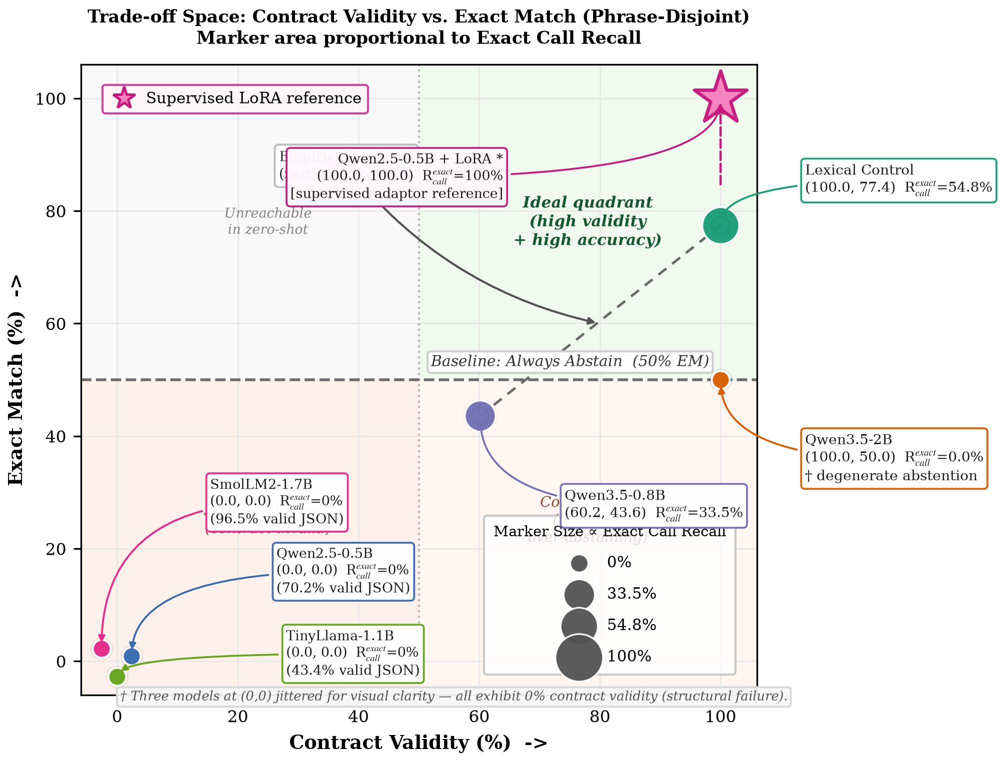
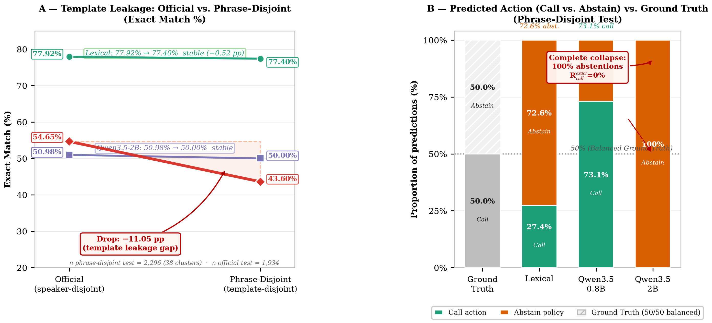
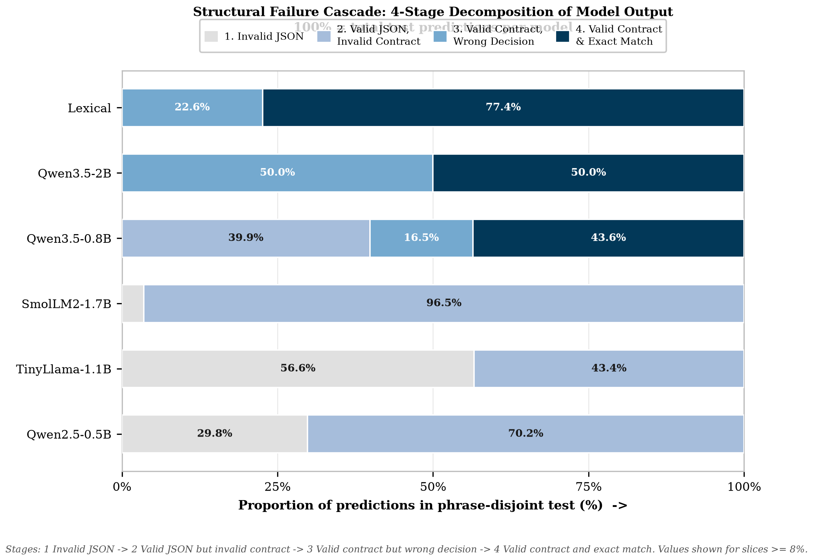

# A Leakage-Aware Benchmark for Ultra-Small Language Models on Structured Speech-Command Routing

**Working paper — ERAMIA-RS 2026**
**Experimental status:** complete zero-shot matrix, 31 August 2026

## Abstract

Small language models are attractive for local command interfaces, but a valid-looking response can still be semantically wrong or impossible to execute. We present a reproducible benchmark of five instruction-tuned checkpoints with at most three billion parameters on a transcript-to-command task. The benchmark derives a narrow two-operation contract from Fluent Speech Commands (FSC), a human-recorded English speech-command corpus: four native semantic combinations map to `media_control` or `volume_adjust`, while all other examples receive an explicitly derived policy-abstention target. We evaluate Qwen2.5-0.5B, Qwen3.5-0.8B, TinyLlama-1.1B, SmolLM2-1.7B, and Qwen3.5-2B with the same canonical prompt and greedy decoding on an NVIDIA RTX 5090. Two balanced protocols separate official speaker disjointness from normalized-template disjointness, and all reports include both item-level and template-cluster statistics. On the phrase-disjoint test, a transparent lexical control reaches 77.40\% exact match, whereas the best model reaches 50.00\% exact match; its 100\% contract-valid rate is explained by near-universal abstention rather than successful call routing. Qwen3.5-0.8B reaches 43.60\% exact match and 60.15\% contract validity, while the other three models obtain zero exact matches under the strict contract. The result is a benchmark and leakage audit, not evidence of Android control, automatic speech recognition, or on-device performance. It shows that structured-output compliance and conservative policy behavior must be measured separately from semantic accuracy in the ultra-small regime.

**Keywords:** ultra-small language models; structured prediction; speech commands; function routing; abstention; data leakage; reproducible benchmarking.

## 1. Scope and research questions

This article deliberately narrows the original mobile-assistant project to a benchmark of ultra-small language models. The parameter cap is strict: no checkpoint with more than 3,000,000,000 parameters is included. The input is an English human speech transcription, and the output is a validated JSON object. The benchmark does not claim Brazilian-Portuguese coverage, Android execution, ASR quality, battery behavior, thermal behavior, or smartphone latency. The phone is not required.

We ask:

1. How do checkpoints below the parameter cap differ in JSON compliance and canonical command accuracy under one declared contract?
2. How much does exact-match performance change when normalized transcription templates are held out, rather than only speakers?
3. Do simple controls provide a meaningful reference for the models?
4. How different are item-level and template-cluster summaries when repeated phrasings occur across speakers?

## 2. Human corpus and derived task

We use Fluent Speech Commands (FSC), introduced as a corpus for end-to-end spoken-language understanding [1]. It contains 30,043 human recordings, 97 speakers, and 31 native intents, with official train, validation, and test partitions. We use the transcriptions and split metadata, not the waveforms. The raw archive remains outside Git and is identified by SHA-256 in the server-local manifest.

FSC is not a command-routing or Android corpus. We therefore define an explicit, generic two-operation contract. Only the following four native combinations become calls:

| Native FSC action | Native object | Derived target |
|---|---|---|
| activate | music | `media_control(action=play)` |
| deactivate | music | `media_control(action=pause)` |
| increase | volume | `volume_adjust(direction=up)` |
| decrease | volume | `volume_adjust(direction=down)` |

Every other retained example receives `{"action":"abstain","tool":null,"arguments":{}}`. This is an experimenter-defined policy label, not a human FSC annotation. To prevent the larger set of unsupported intents from dominating the score, the generator samples a balanced 1:1 mixture of calls and policy abstentions within each split. Each derived dataset contains 14,956 records: 7,478 calls and 7,478 abstentions.

The contract checks exactly three top-level fields (`action`, `tool`, and `arguments`), restricts tool names to the two declared operations, and validates the required argument enums. It is an evaluation target only; it does not execute a tool or grant any permission.

## 3. Leakage-audited protocols

The first protocol preserves FSC's official speaker-disjoint split. It measures transfer to held-out speakers but does not prevent repeated normalized transcriptions from crossing partitions. The second protocol assigns each Unicode-normalized, case-folded, whitespace-normalized and punctuation-stripped transcription template to one split within its native FSC label. Speakers may occur in more than one split in this second protocol by design.

| Protocol | Train | Dev | Test | Split control | Unique templates (train/dev/test) |
|---|---:|---:|---:|---|---|
| Official, speaker-disjoint | 11,442 | 1,580 | 1,934 | speakers | 248 / 245 / 247 |
| Phrase-disjoint | 10,458 | 2,202 | 2,296 | templates | 178 / 32 / 38 |

The official protocol has zero speaker intersections but 245, 247, and 244 template intersections for train--dev, train--test, and dev--test, respectively. The phrase-disjoint protocol has zero template intersections. Because its test set contains only 38 template clusters, its cluster intervals are intentionally wide; this is a limitation to report, not a reason to pool the clusters with individual examples.

## 4. Models and execution

The matrix contains five checkpoints. Parameter counts are computed by summing tensor shapes in the local safetensors files; this makes the cap auditable and includes all checkpoint components. Qwen3.5 checkpoints are exposed by Transformers as multimodal conditional-generation models, but no image or video input is supplied in this transcript-only experiment.

| Checkpoint | Parameters | Family | HF revision |
|---|---:|---|---|
| Qwen2.5-0.5B-Instruct | 494,032,768 | Qwen2 | `7ae5576` |
| Qwen3.5-0.8B | 873,438,784 | Qwen3.5 | `2fc0636` |
| TinyLlama-1.1B-Chat-v1.0 | 1,100,048,384 | Llama | `fe8a4ea` |
| SmolLM2-1.7B-Instruct | 1,711,376,384 | SmolLM | `31b70e2` |
| Qwen3.5-2B | 2,274,069,824 | Qwen3.5 | `15852e8` |

The excluded Qwen2.5-3B-Instruct checkpoint has 3,085,938,688 measured parameters and therefore exceeds the strict cap. Qwen3.5-4B-Base is also excluded. The complete IDs, revisions, licenses, and counts are recorded in `benchmarks/ultrasmall_models.json`.

All models use their native chat template with the same English semantic instruction, the same compact catalog, greedy decoding (`do_sample=false`), and a 64-token generation cap. The template mode and model class are recorded per prediction. Runs use Transformers 5.3.0, PyTorch 2.10.0+cu128, and one NVIDIA GeForce RTX 5090 with 32 GB VRAM. No fine-tuning is part of the main matrix. A previously completed Qwen2.5-0.5B LoRA run is retained as an exploratory artifact and is not used in the model comparison.

## 5. Metrics and controls

The evaluator distinguishes:

- parseability and JSON validity;
- contract validity, including the allowed action/tool/argument constraints;
- exact match against the derived target;
- action accuracy and tool/argument accuracy on call gold items;
- abstention precision, recall, and F1.

The primary accuracy comparison is item-level exact match accompanied by template-level summaries. For each `template_id`, the evaluator computes the mean exact-match rate, mean action accuracy, mean abstention F1, and the strict proportion of clusters whose items are all exact. Cluster-bootstrap 95\% intervals resample template IDs, not rows. Wilson intervals are retained as descriptive item-level intervals but are not treated as leakage-aware uncertainty.

Two deterministic controls use only the transcription text and contract. `always_abstain` returns the policy abstention for every item. `lexical` uses transparent regular expressions over media/volume and play/pause/increase/decrease cues; it never reads FSC native labels or metadata.

## 6. Results

### 6.1 Main phrase-disjoint comparison

| System | Parseable | Contract valid | Exact match | Abstention F1 | Template-macro exact |
|---|---:|---:|---:|---:|---:|
| Always abstain | 100.00\% | 100.00\% | 50.00\% | 66.67\% | 76.32\% |
| Lexical control | 100.00\% | 100.00\% | **77.40\%** | 81.56\% | **89.47\%** |
| Qwen2.5-0.5B | 70.17\% | 0.00\% | 0.00\% | -- | 0.00\% |
| Qwen3.5-0.8B | 100.00\% | 60.15\% | 43.60\% | 69.92\% | 50.00\% |
| TinyLlama-1.1B | 43.42\% | 0.00\% | 0.00\% | -- | 0.00\% |
| SmolLM2-1.7B | 96.47\% | 0.00\% | 0.00\% | -- | 0.00\% |
| Qwen3.5-2B | 100.00\% | 100.00\% | 50.00\% | 66.67\% | 76.32\% |

The lexical control outperforms every zero-shot model on exact match. Qwen3.5-2B is contract-valid on every item but obtains only 50.00\% exact match: its output behavior is dominated by abstention, which is correct for policy negatives but wrong for calls. Qwen3.5-0.8B is the only model with a substantial mixture of valid calls and abstentions, yet its exact match remains below the lexical control. The other three checkpoints produce parseable text often enough to be measurable, but their responses do not satisfy the declared canonical schema.


*Figure 1: Trade-off space on the phrase-disjoint test ($n=2{,}296$ items, 38 template clusters). $x$: contract validity (\%), $y$: exact match (item-level \%). Marker area $\propto$ exact call recall (proportion of gold calls with correct tool and arguments). Qwen3.5-2B attains 100\% validity via degenerate abstention (exact call recall 0\%); lexical control (100.0, 77.4) dominates the zero-shot systems; Qwen3.5-0.8B (60.2, 43.6) trades validity for calls. Three models overlap at (0,0) with 0\% validity and are jittered for legibility. Star: Qwen2.5-0.5B+LoRA adaptor (100, 100), non-zero-shot supervised reference.*

### 6.2 Official speaker-disjoint comparison

| System | Contract valid | Exact match | Template-macro exact |
|---|---:|---:|---:|
| Always abstain | 100.00\% | 50.00\% | 75.71\% |
| Lexical control | 100.00\% | **77.92\%** | **89.07\%** |
| Qwen2.5-0.5B | 0.00\% | 0.00\% | 0.00\% |
| Qwen3.5-0.8B | 73.47\% | 54.65\% | 56.28\% |
| TinyLlama-1.1B | 0.00\% | 0.00\% | 0.00\% |
| SmolLM2-1.7B | 0.78\% | 0.00\% | 0.00\% |
| Qwen3.5-2B | 100.00\% | 50.98\% | 76.11\% |

The official split gives Qwen3.5-0.8B a higher exact-match rate than phrase-disjoint (54.65\% versus 43.60\%), an observed drop of 11.05 percentage points when template overlap is removed. However, its template-cluster bootstrap interval for phrase-disjoint exact match is [26.02\%, 63.35\%], meaning this descriptive drop falls within the cluster uncertainty interval and reflects the small number of independent template clusters (38). Qwen3.5-2B changes from 50.98\% to 50.00\%, while the lexical control is comparatively stable (77.92\% to 77.40\%). The official split therefore cannot be read as lexical generalization.


*Figure 2: Template leakage and policy collapse (phrase-disjoint test is 50\% call / 50\% abstain). (A) Exact match on official vs. phrase-disjoint, showing the -11.05 pp leakage gap for Qwen3.5-0.8B. (B) Predicted action distribution vs. balanced ground truth, showing the complete collapse of Qwen3.5-2B into 100\% abstentions.*

### 6.3 Structural error audit and latency

The failure modes are qualitatively different. Qwen2.5-0.5B frequently emits JSON-like objects with an operation name in `action`, rather than the required `action=call` plus a tool field. TinyLlama frequently explains the answer or reaches the 64-token cap before closing the object. SmolLM2 often emits a plausible JSON object with the wrong field structure. These cases explain why parseability is not interchangeable with contract validity.


*Figure 3: Structural cascade on the phrase-disjoint test ($n=2{,}296$). Each bar decomposes predictions into: (1) invalid JSON, (2) valid JSON but contract-invalid schema, (3) contract-valid but wrong decision, (4) contract-valid and exact match.*

Server-side single-request latency is reported only as an engineering observation. On phrase-disjoint, mean / median / p95 milliseconds were: Qwen2.5-0.5B 81.4 / 91.0 / 176.0; Qwen3.5-0.8B 324.1 / 327.2 / 448.9; TinyLlama 301.5 / 300.2 / 311.6; SmolLM2 122.9 / 106.7 / 220.1; and Qwen3.5-2B 345.1 / 338.4 / 395.9. These values depend on server load, Transformers implementation, prompt length, and decoding behavior; they are not smartphone measurements.

## 7. Discussion

The benchmark does not support a monotonic “more parameters is better” conclusion. The 2.274B Qwen3.5 checkpoint is structurally compliant but conservative to the point of abstaining on calls. The 0.873B Qwen3.5 checkpoint routes more calls but loses both contract validity and exactness on unseen templates. The external-family checkpoints demonstrate that instruction tuning and model size alone do not guarantee compatibility with a strict output contract.

The lexical control is essential. Without it, the 50\% balanced abstention baseline could make a model that refuses everything appear competitive. The cluster analysis is also essential: repeated templates give some systems much larger effective row counts than the number of independent phrasings. The phrase-disjoint test has only 38 clusters, so its uncertainty is broad; nevertheless, it directly answers a different question from speaker transfer and should not be merged with the official result.

The derived abstention labels require particular caution. They express the declared benchmark policy, not human judgments that a command is unsafe or unsupported in a production assistant. A deployed system would need an independent policy layer, schema validator, confidence handling, and execution authorization. The present experiment stops before all of those layers.

In contrast, two techniques would change the reading of Figures 1–3 but are deliberately kept outside the zero-shot matrix. The retained Qwen2.5-0.5B+LoRA adaptor (star in Figure 1) reaches 100\% contract validity and 100\% exact match on the same phrase-disjoint split; as a supervised in-distribution adaptor it shows the contract is learnable, not that zero-shot routing is solved, and is therefore not commensurable with the greedy zero-shot results. Constrained decoding via grammar-enforced generation (GBNF grammars in `llama.cpp`, Outlines, Guidance) would likewise guarantee 100\% validity by construction and collapse stages 1–2 of Figure 2 to zero. This enforces syntactic compliance without implying semantic correctness: a grammar can force a valid `{action, tool, arguments}` shape while leaving call-vs-abstain discrimination and argument exactness to the model. We therefore keep the main benchmark unconstrained and report validity separately from exact match, treating LoRA and grammar-constrained decoding as explicit, non-zero-shot baselines for future work.

## 8. Reproducibility and data governance

The Neuromancer repository records the model matrix, checkpoint revisions, parameter-count method, generic contract, deterministic FSC generator, both split manifests, validator, controls, common inference script, cluster-aware evaluator, runner, logs, and aggregate reports. From the repository root, the reproducible main command (offline, reusing cached predictions) is:

```bash
HF_HUB_OFFLINE=1 python scripts/run_ultrasmall_benchmark.py \
  --skip-training --skip-existing
```

If an isolated interpreter is required, prefix with the local environment, e.g., `.venv/bin/python scripts/run_ultrasmall_benchmark.py`.

The raw FSC archive and derived JSONL files remain server-local. The source license is recorded as CC BY-NC-ND 4.0 for academic research; no audio, transcript, or per-example prediction is redistributed in Git. Aggregate metrics are sufficient to audit the reported claims without publishing restricted data.

## 9. Limitations and next gates

1. FSC is an English smart-home/assistant corpus, not a native Android or Brazilian-Portuguese command corpus.
2. The four call labels and all abstention labels are derived by a manually declared bridge rather than a native multi-turn dialog context.
3. The task consumes transcriptions, so ASR errors and acoustic variability are not evaluated.
4. The phrase-disjoint test has only 38 unique template clusters, leading to wide bootstrap uncertainty intervals.
5. Native chat templates differ across model families; this is logged but remains a possible prompt-format confound.
6. The main matrix is zero-shot and uses one deterministic decoding setting and one checkpoint revision per model; it does not estimate training variance.
7. No model output is executed, and no result is measured on the physical phone.
8. The benchmark evaluates a compact two-tool contract; evaluating richer task-oriented spoken datasets such as SLURP [2] and STOP [3], as well as standard API tool leaderboards like BFCL [14], constitutes a natural cross-domain extension.

## 10. Conclusion

We provide a leakage-aware, reproducible benchmark for five ultra-small language models on structured routing from human-origin speech transcriptions. The central result is negative but useful: under a strict canonical contract, a transparent lexical control outperforms every zero-shot model, while the largest model's perfect contract validity is mostly universal abstention. The benchmark therefore separates output compliance, policy abstention, and semantic exactness, and makes phrase leakage visible. It is a defensible first article for the ultra-small-model benchmark scope; Android deployment, ASR, Portuguese human data, and physical-device evaluation are future studies rather than claims of this paper.

## References

[1] L. Lugosch et al. “Speech Model Pre-Training for End-to-End Spoken Language Understanding.” *Interspeech*, 2019.
[2] E. Bastianelli et al. “SLURP: A Spoken Language Understanding Resource Package.” *EMNLP*, 2020.
[3] P. Tomasello et al. “STOP: A Dataset for Spoken Task-Oriented Semantic Parsing.” *IEEE SLT*, 2023.
[4] A. Coucke et al. “Snips Voice Platform: An Embedded Spoken Language Understanding System for Private-by-Design Voice Interfaces.” *arXiv:1805.10190*, 2018.
[5] Z. Liu et al. “MobileLLM: Optimizing Sub-Billion Parameter Language Models for On-Device Use Cases.” *ICML*, 2024.
[6] M. Abdin et al. “Phi-3 Technical Report: A Highly Capable Language Model Locally on Your Phone.” *arXiv:2404.14219*, 2024.
[7] P. Zhang et al. “TinyLlama: An Open-Source Small Language Model.” *arXiv:2401.02385*, 2024.
[8] L. Lozhkov et al. “SmolLM2: When Smol Goes Big — Data-Centric Training of a Small Language Model.” *arXiv:2502.02737*, 2025.
[9] Qwen Team. “Qwen3.5 Model Card.” *Hugging Face*, 2026.
[10] E. J. Hu et al. “LoRA: Low-Rank Adaptation of Large Language Models.” *ICLR*, 2022.
[11] B. T. Willard and R. Louf. “Efficient Guided Generation for Large Language Models.” *arXiv:2307.09702*, 2023.
[12] S. Ugur et al. “SynCode: LLM Generation with Grammar Augmentation.” *Transactions on Machine Learning Research (TMLR)*, 2025.
[13] T. Schick et al. “Toolformer: Language Models Can Teach Themselves to Use Tools.” *NeurIPS*, 2023.
[14] S. G. Patil et al. “The Berkeley Function Calling Leaderboard (BFCL): From Tool Use to Agentic Evaluation.” *ICML*, 2025.
[15] Y. Geifman and R. El-Yaniv. “Selective Classification for Deep Neural Networks.” *NeurIPS*, 2017.
